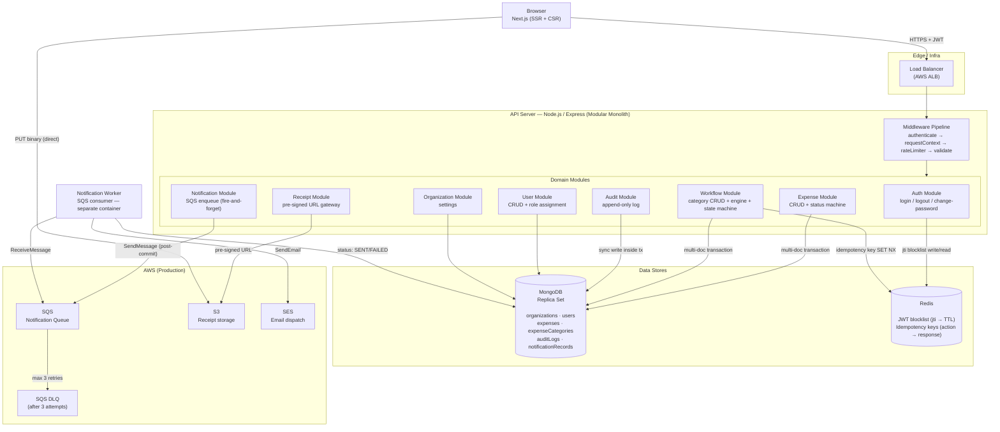
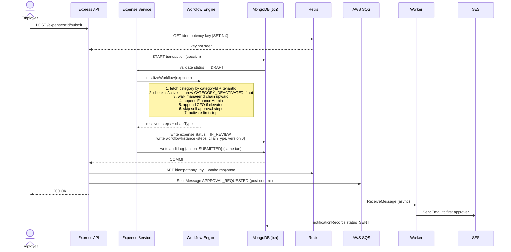

# Expense Management System

A production-grade, multi-tenant expense management platform with automatic org-tree-based approval workflows, role-based access control, and a full audit trail. Built with Next.js 14, Node.js/Express, TypeScript, MongoDB, and Docker.

> **AI-assisted engineering**: This project was designed and implemented using a structured prompt chain. All AI prompts and the resulting architecture artifacts are in the [`ai/`](./ai/) folder — see [AI Design Process](#ai-design-process) below.

---

## Table of Contents

- [Live Demo Credentials](#live-demo-credentials)
- [Quick Start](#quick-start)
- [Tech Stack](#tech-stack)
- [System Architecture](#system-architecture)
- [Org Hierarchy & Approval Chain](#org-hierarchy--approval-chain)
- [Data Models](#data-models)
- [API Reference](#api-reference)
- [Workflow State Machine](#workflow-state-machine)
- [Role & Permission Model](#role--permission-model)
- [Scalability & AWS Production Plan](#scalability--aws-production-plan)
- [Security](#security)
- [Project Structure](#project-structure)
- [AI Design Process](#ai-design-process)

---

## Live Demo Credentials

> **Important:** The **Tenant ID changes every time you run the seed script** because a new Organization document is created. After seeding, get the current Tenant ID with:
> ```bash
> mongosh expensedb --quiet --eval 'db.organizations.findOne({},{_id:1,name:1})'
> ```
> The seed script also prints it to the console at the end.

**Current Tenant ID (after last seed):** `6a4b5dfe76c8d526a38218d8`  
**All passwords:** `Password1!`  
**Login URL:** [http://localhost:3000/login](http://localhost:3000/login)

The login form requires three fields: **Email**, **Password**, and **Tenant ID**.

### All Users

| Email | Password | Role | Reports To |
|---|---|---|---|
| `alice@acme.com` | `Password1!` | Org Admin / CFO | — (top, no manager) |
| `frank@acme.com` | `Password1!` | Finance Admin | — (separate, always final approver) |
| `victor@acme.com` | `Password1!` | Manager L1 | Alice Admin |
| `diana@acme.com` | `Password1!` | Manager L1 | Alice Admin |
| `mike@acme.com` | `Password1!` | Manager L2 | Victor VP |
| `rachel@acme.com` | `Password1!` | Manager L2 | Victor VP |
| `olivia@acme.com` | `Password1!` | Manager L2 | Diana Director |
| `emma@acme.com` | `Password1!` | Employee | Mike Manager |
| `liam@acme.com` | `Password1!` | Employee | Mike Manager |
| `sophia@acme.com` | `Password1!` | Employee | Mike Manager |
| `james@acme.com` | `Password1!` | Employee | Rachel Rodriguez |
| `priya@acme.com` | `Password1!` | Employee | Rachel Rodriguez |
| `noah@acme.com` | `Password1!` | Employee | Rachel Rodriguez |
| `ethan@acme.com` | `Password1!` | Employee | Olivia Chen |
| `ava@acme.com` | `Password1!` | Employee | Olivia Chen |
| `leo@acme.com` | `Password1!` | Employee | Diana Director |

### What to try after logging in

| Login as | What to do |
|---|---|
| `emma@acme.com` | Create a new expense → Submit → watch the chain activate |
| `mike@acme.com` | Go to Approvals → Approve or Reject Emma's expense |
| `victor@acme.com` | Approve the next step after Mike |
| `frank@acme.com` | Final Finance Admin approval — expense moves to APPROVED |
| `alice@acme.com` | Create categories, manage users, view all expenses & audit logs |

### Approval chain examples (auto-built from org tree)

| Submitter | Amount | Category | Chain type | Approvers |
|---|---|---|---|---|
| Emma | $120 | Travel ($500 threshold) | STANDARD | Mike → Victor → Frank |
| Emma | $800 | Travel ($500 threshold) | ELEVATED | Mike → Victor → Frank → Alice |
| Leo | $75 | Meals ($100 threshold) | STANDARD | Diana → Frank |
| Leo | $1,200 | Training ($1,000 threshold) | ELEVATED | Diana → Frank → Alice |
| Ethan | $450 | Software ($300 threshold) | ELEVATED | Olivia → Diana → Frank → Alice |

---

## Quick Start

### Prerequisites

- Docker & Docker Compose
- Local MongoDB running on port `27017` (no MongoDB container — uses your local instance)

### 1. Clone & configure

```bash
git clone https://github.com/yash-gupta2000/ExpenseManagement.git
cd ExpenseManagement
cp .env.example .env
```

`.env` (already correct for local dev):
```env
MONGODB_URI=mongodb://127.0.0.1:27017/expensedb
PORT=4000
JWT_SECRET=super-secret-jwt-key-for-local-dev-only
JWT_EXPIRES_IN=86400
UPLOAD_DIR=./uploads
NEXT_PUBLIC_API_URL=http://localhost:4000/api/v1
```

### 2. Start containers

```bash
docker compose up --build -d
```

Two services start:
- **backend** on `http://localhost:4000`
- **frontend** on `http://localhost:3000`

The backend connects to your local MongoDB via `host.docker.internal:27017`.

### 3. Seed the database

```bash
cd backend && npx ts-node seeds/seed.ts
```

Or from inside the container:
```bash
docker exec expense-backend npm run seed
```

The seed script:
- Wipes all existing data (users, expenses, categories, organizations)
- Creates **Acme Corp** as the single tenant
- Creates **16 users** across a 3-level management hierarchy
- Creates **5 expense categories** with thresholds
- Creates **12 test expenses** in various states (APPROVED, IN_REVIEW, REJECTED, DRAFT)

The console output at the end looks like:
```
╔══════════════════════════════════════════════════════════════╗
║                     SEED COMPLETE                           ║
╠══════════════════════════════════════════════════════════════╣
║  Org: Acme Corp   Tenant: 6a4b5dfe76c8d526a38218d8         ║
╠══════════════════════════════════════════════════════════════╣
║  All passwords: Password1!                                  ║
...
```

**Copy the Tenant ID** — you need it on the login screen.

### 4. Open the app

Go to [http://localhost:3000](http://localhost:3000).

On the login screen enter:
- **Email**: any email from the table above (e.g. `emma@acme.com`)
- **Password**: `Password1!`
- **Tenant ID**: the ID printed by the seed script (e.g. `6a4b5dfe76c8d526a38218d8`)

> If you lose the Tenant ID, run: `mongosh expensedb --quiet --eval 'db.organizations.findOne({},{_id:1})'`

---

## Tech Stack

| Layer | Technology |
|---|---|
| **Frontend** | Next.js 14 (App Router), TypeScript, Tailwind CSS |
| **Backend** | Node.js, Express, TypeScript |
| **Database** | MongoDB (single-node local; replica set for production) |
| **Auth** | JWT HS256, bcrypt (12 rounds) |
| **Validation** | Zod (request body + query schemas) |
| **File Uploads** | Multer (local disk for dev; S3 pre-signed URLs in production) |
| **Containerization** | Docker, Docker Compose |
| **Logging** | Pino (structured JSON) |

---

## System Architecture

The system is a **modular monolith** for the MVP. Each domain is a self-contained module (routes → controller → service → repository → model) with no cross-module file imports. Module boundaries are real — extraction to microservices later is straightforward.



### Expense Submission Flow



---

## Org Hierarchy & Approval Chain

The approval chain is **automatically built** from each employee's `managerId` links — no manual chain configuration needed. When an expense is submitted:

1. Walk `managerId` upward until reaching an `orgAdmin` tier (stops before CFO)
2. Append **Finance Admin** (always the final approver before CFO)
3. If amount exceeds the category's threshold → **ELEVATED** chain: append the CFO

```
Alice Admin (orgAdmin / CFO)              ← stops here (not intermediate)
  ├── Victor VP (manager L1)
  │     ├── Mike Manager (manager L2)
  │     │     ├── Emma Employee
  │     │     ├── Liam Lee
  │     │     └── Sophia Patel
  │     └── Rachel Rodriguez (manager L2)
  │           ├── James Kim
  │           ├── Priya Singh
  │           └── Noah Brown
  └── Diana Director (manager L1)
        ├── Olivia Chen (manager L2)
        │     ├── Ethan Gupta
        │     └── Ava Sharma
        └── Leo Martinez

Frank Finance (financeAdmin) ← separate, always last before CFO
```

**Chain examples:**

| Employee | Amount | Category Threshold | Chain |
|---|---|---|---|
| Emma | $120 | Travel $500 | Mike → Victor → Frank |
| Emma | $800 | Travel $500 | Mike → Victor → Frank → Alice |
| Leo | $75 | Meals $100 | Diana → Frank |
| Ethan | $450 | Software $300 | Olivia → Diana → Frank → Alice |

### Category Configuration

Admins only set two things per category — the engine handles the rest:

| Category | Threshold | CFO for Elevated |
|---|---|---|
| Travel | $500 | Alice Admin |
| Office Supplies | $200 | Alice Admin |
| Meals & Entertainment | $100 | Alice Admin |
| Software & Subscriptions | $300 | Alice Admin |
| Training & Conferences | $1,000 | Alice Admin |

---

## Data Models

### Expense (with embedded workflow)

```json
{
  "_id": "ObjectId",
  "tenantId": "ObjectId",
  "submittedBy": "ObjectId",
  "title": "string",
  "amount": 12000,
  "currency": "USD",
  "date": "Date",
  "categoryId": "ObjectId",
  "categoryName": "string (denormalized)",
  "description": "string",
  "receiptPath": "string",
  "status": "DRAFT | SUBMITTED | IN_REVIEW | APPROVED | REJECTED | PAID",
  "workflowInstance": {
    "categoryId": "ObjectId",
    "chainType": "STANDARD | ELEVATED",
    "version": 0,
    "status": "ACTIVE | COMPLETED | REJECTED | CANCELLED",
    "steps": [
      {
        "stepIndex": 0,
        "approverId": "ObjectId",
        "approverName": "string",
        "status": "PENDING | ACTIVE | APPROVED | REJECTED | SKIPPED",
        "comment": "string | null",
        "decidedAt": "Date | null"
      }
    ],
    "currentStepIndex": 0,
    "startedAt": "Date",
    "completedAt": "Date | null"
  },
  "workflowHistory": []
}
```

The workflow instance is **embedded** in the expense document — every approval action is a single-document write with no cross-collection transaction required. Optimistic locking via `version` field prevents concurrent conflicting updates.

### User

```json
{
  "_id": "ObjectId",
  "tenantId": "ObjectId",
  "email": "string (unique within tenant)",
  "passwordHash": "string (never returned in responses)",
  "firstName": "string",
  "lastName": "string",
  "department": "string",
  "managerId": "ObjectId | null",
  "roles": ["employee", "manager", "financeAdmin", "orgAdmin"],
  "isActive": true
}
```

### Expense Category

```json
{
  "_id": "ObjectId",
  "tenantId": "ObjectId",
  "name": "string",
  "isActive": true,
  "amountThreshold": 50000,
  "cfoId": "ObjectId | null"
}
```

### Audit Log

```json
{
  "_id": "ObjectId",
  "tenantId": "ObjectId",
  "expenseId": "ObjectId",
  "actorId": "ObjectId",
  "actorName": "string",
  "action": "SUBMITTED | APPROVED | REJECTED | SENT_BACK | WITHDRAWN | MARKED_PAID",
  "fromStatus": "string",
  "toStatus": "string",
  "comment": "string",
  "stepIndex": 0
}
```

Audit is a **separate collection** — append-only, never updated or deleted. Finance Admins and Org Admins can query the full trail per expense.

---

## API Reference

Base URL: `http://localhost:4000/api/v1`

All protected endpoints require `Authorization: Bearer <token>`.

### Auth

```
POST   /auth/login              { email, password, tenantId }
POST   /auth/change-password    { currentPassword, newPassword }
```

### Expenses

```
GET    /expenses                 List (role-scoped: own / pending / all)
POST   /expenses                 Create draft
GET    /expenses/:id             Get by ID
PATCH  /expenses/:id             Update draft
POST   /expenses/:id/submit      Submit for approval (initializes workflow)
POST   /expenses/:id/withdraw    Withdraw before review starts
POST   /expenses/:id/mark-paid   Mark approved expense as paid (financeAdmin)
DELETE /expenses/:id             Delete draft

POST   /expenses/:id/workflow/approve     Approve current step
POST   /expenses/:id/workflow/reject      Reject (terminates workflow)
POST   /expenses/:id/workflow/send-back   Send back to employee (archives workflow)

GET    /expenses/:id/audit       Full audit trail for this expense
```

### Expense Categories

```
GET    /expense-categories               List all
POST   /expense-categories               Create (financeAdmin / orgAdmin)
GET    /expense-categories/:id           Get by ID
PATCH  /expense-categories/:id           Update threshold / CFO
POST   /expense-categories/:id/activate  Activate
POST   /expense-categories/:id/deactivate Deactivate
```

### Users

```
GET    /users                    List all (orgAdmin)
POST   /users                    Create (orgAdmin)
GET    /users/:id                Get by ID
PATCH  /users/:id                Update profile / managerId
PUT    /users/:id/roles          Assign roles
POST   /users/:id/activate       Activate account
POST   /users/:id/deactivate     Deactivate account
```

### Receipts

```
POST   /receipts/upload          Upload receipt file (multipart/form-data, field: receipt)
GET    /receipts/:filename        Serve uploaded file
```

### Authorization Matrix

| Action | Employee | Manager | Finance Admin | Org Admin |
|---|---|---|---|---|
| Create expense | ✅ | ✅ | ✅ | ✅ |
| View own expense | ✅ | ✅ | ✅ | ✅ |
| View all expenses | ❌ | ❌ | ✅ | ✅ |
| Submit expense | ✅ own | ✅ own | ✅ own | ✅ own |
| Withdraw expense | ✅ own | ✅ own | ❌ | ❌ |
| Approve / Reject / Send Back | ❌ | ✅ assigned step | ✅ assigned step | ❌ |
| Mark as Paid | ❌ | ❌ | ✅ | ❌ |
| Manage users | ❌ | ❌ | ❌ | ✅ |
| Manage categories | ❌ | ❌ | ✅ | ✅ |
| View audit log | ❌ | ❌ | ✅ | ✅ |

---

## Workflow State Machine

```
DRAFT
  │
  ├─ submit() ──────────────────────────────► IN_REVIEW
  │                                               │
  │                          approve (intermediate step)
  │                                               │
  │                          approve (final step) ──► APPROVED
  │                                               │        │
  │                          reject() ──► REJECTED    mark-paid() ──► PAID
  │                                               │
  │                          send-back() ──────────────────────────► DRAFT
  │                                                        (new workflow on resubmit)
  └─ withdraw() ◄─────────────────────────────────────────────────── SUBMITTED / IN_REVIEW
                                              (before any approver acts)
```

**Key invariants:**
- Chain is frozen at submission — changing a category after doesn't affect in-flight expenses
- Self-approval steps are auto-SKIPPED
- Optimistic lock (`version`) prevents concurrent conflicting approvals — second request gets `409 CONFLICT`
- Every transition is atomic — no partial state possible
- `workflowHistory` archives previous cycles when an expense is sent back and resubmitted

---

## Role & Permission Model

**Employee** — Create, edit (draft only), submit, and withdraw their own expenses.

**Manager** — Everything an Employee can do. Plus: approve, reject, or send back expenses where they are the current ACTIVE step approver.

**Finance Admin** — Read all expenses in the tenant. Approve/reject/send-back when assigned. Mark approved expenses as Paid. Create and manage expense categories. View audit logs.

**Organization Admin** — Create and manage users, assign roles. Cannot approve expenses or configure approval categories. This is an intentional separation of duties: the person managing users should not also control approval chains.

> A user can hold multiple roles simultaneously (e.g., both Employee and Manager).

---

## Scalability & AWS Production Plan

The following is the **planned production architecture on AWS**. The current implementation runs locally with Docker but is designed to map cleanly to this topology.

### Infrastructure Components

| Component | AWS Service | Purpose |
|---|---|---|
| API tier | ECS Fargate (stateless containers) | Horizontally scalable, no session state |
| Frontend | ECS Fargate or Vercel | Next.js SSR |
| Load Balancer | Application Load Balancer (ALB) | Routes HTTPS to API |
| Database | MongoDB Atlas (M10+ replica set) | Multi-document transactions, read replicas for analytics |
| Cache / Auth | ElastiCache (Redis) | JWT blocklist (jti → TTL), idempotency keys |
| File Storage | Amazon S3 | Receipt storage via pre-signed upload URLs — binary never passes through API |
| Async Notifications | Amazon SQS + SES | Decoupled email delivery, SQS DLQ after 3 retries |
| Secrets | AWS Secrets Manager | JWT secret, DB credentials, SES config |
| Observability | CloudWatch Logs + Metrics | Structured JSON logs, DLQ depth alarms |
| CI/CD | GitHub Actions → ECR → ECS | Blue/green deploy |

### Scalability Design Decisions

**Stateless API.** JWTs carry all authentication context. Any API instance handles any request. Scale horizontally by adding ECS tasks behind ALB.

**Tenant-prefixed indexes.** Every MongoDB query starts with a `tenantId` filter. Every index is prefixed with `tenantId`. Large tenant data volumes don't degrade performance for others. Collections can be sharded by `tenantId` at extreme scale.

**Embedded workflow for write efficiency.** The workflow instance is embedded in the expense document. An approval action (approve/reject/send-back) is a single-document write. No multi-collection transaction needed for the common case.

**Multikey index for manager approval queue.** The heaviest read path is "show all expenses I need to approve." This hits a multikey index on `workflowInstance.steps.approverId + status`, not a collection scan.

**Async notifications via SQS.** Email delivery is fully decoupled from the request path. An approval action returns to the client as soon as the MongoDB transaction commits. SQS enqueue is fire-and-forget, post-commit. SES failures never roll back business state.

**Rate limiting per tenant.** Enterprise customers route traffic from hundreds of employees through shared corporate IPs. Per-tenant limits (Redis counter) prevent one noisy tenant from starving others.

**Cursor-based pagination.** All list endpoints use cursor-based pagination, not offset. Offset degrades as collections grow; cursors are constant-time.

**Read replicas for audit/analytics.** Audit log queries and org-wide expense reports are read-heavy but not latency-sensitive. Route to MongoDB read replica as traffic grows, without touching the primary.

---

## Security

**JWT + blocklist.** Tokens have a 24-hour TTL (configurable). On logout or password change, the token's `jti` is written to Redis with a TTL matching remaining token lifetime. The authenticate middleware checks the blocklist before any business logic.

**Tenant isolation enforced at repository layer.** `tenantId` is a required parameter on every repository method — not an optional filter. A missing tenantId is a compile-time error. Integration tests assert cross-tenant isolation by creating two tenants and verifying neither can access the other's data.

**404 not 403 for unauthorized resources.** Resources a user can't access return 404, not 403. A 403 confirms the resource exists — information usable for enumeration attacks.

**Passwords hashed with bcrypt (12 rounds).** `passwordHash` is excluded at the repository layer, not filtered in the controller.

**No stack traces in responses.** Error responses contain only `code`, `message`, and `traceId`. Full traces are server-side only. Users can report a `traceId` to support without leaking implementation details.

**S3 pre-signed URLs (production).** Files upload directly from browser to S3 — binary never touches the API server. Upload and download URLs have 5-minute expiry. `receiptKey` is validated for the correct tenant prefix before being attached to an expense.

**Structured tracing.** A `traceId` is generated per request and flows through to the SQS payload. The notification worker logs it. End-to-end trace from HTTP request → async email dispatch, without a distributed tracing infrastructure.

---

## Project Structure

```
.
├── backend/
│   ├── src/
│   │   ├── config/           # env validation, DB connection
│   │   ├── middleware/       # authenticate, authorize, validate, errorHandler
│   │   ├── modules/
│   │   │   ├── auth/         # login, change-password
│   │   │   ├── expense/      # CRUD + status machine + workflow actions
│   │   │   ├── workflow/     # category CRUD + workflow engine + state transitions
│   │   │   ├── user/         # user CRUD + role assignment
│   │   │   ├── audit/        # append-only audit log
│   │   │   ├── receipt/      # file upload + serve
│   │   │   └── organization/ # org settings
│   │   ├── routes/           # root router
│   │   ├── shared/           # errors, types, logger
│   │   └── server.ts         # bootstrap (mongoose plugin registered FIRST)
│   ├── seeds/
│   │   └── seed.ts           # full org hierarchy + test expenses
│   ├── Dockerfile
│   └── package.json
│
├── frontend/
│   └── src/
│       ├── app/              # Next.js App Router pages
│       │   └── dashboard/
│       │       ├── expenses/ # list, detail, new, edit
│       │       ├── approvals/
│       │       ├── categories/
│       │       ├── users/
│       │       └── audit/
│       ├── components/
│       │   ├── ui/           # Button, Input, Select, Modal, Table, Badge, Alert
│       │   └── layout/       # Sidebar, Header
│       ├── lib/              # api client (axios), auth helpers, utils
│       └── types/            # shared TypeScript interfaces
│
├── ai/                       # AI design process (see below)
│   ├── prompts/              # 6 structured prompts used to generate design
│   └── artifacts/            # generated PRD, architecture, data model, API, impl plan
│
├── docs/
│   └── submission.md         # full design doc (assumptions, NFRs, security, scalability)
│
├── docker-compose.yml        # backend + frontend (no MongoDB container — uses local)
├── .env.example
└── uploads/                  # local receipt storage (Docker volume)
```

---

## AI Design Process

This project was designed using a **structured prompt engineering chain** — each prompt produced an artifact that fed the next stage, simulating a real engineering design review process.

### Prompts → Artifacts

| # | Prompt | Artifact |
|---|---|---|
| 01 | [Senior Product Engineer](./ai/prompts/01-senior-product-engineer-prompt.md) | [Product Requirements Doc](./ai/artifacts/01-product-requirements.md) |
| 02 | [Staff Engineer Technical Design](./ai/prompts/02-staff-engineer-technical-design-prompt.md) | [Architecture V1](./ai/artifacts/02-technical-design.md) |
| 03 | [Principal Engineer Architecture Review](./ai/prompts/03-principal-engineer-architecture-review-prompt.md) | [Architecture V2 (Final)](./ai/artifacts/03-technical-design-final.md) |
| 04 | [Senior Backend Engineer — Persistence](./ai/prompts/04-senior-backend-engineer-persistence-design-prompt.md) | [Data Model Design](./ai/artifacts/04-persistence-data-model-design-final.md) |
| 05 | [Senior Backend Engineer — API Design](./ai/prompts/05-senior-backend-engineer-api-design-prompt.md) | [API Design](./ai/artifacts/05-api-design.md) |
| 06 | [Senior Backend Engineer — Implementation Plan](./ai/prompts/06-senior-backend-engineer-implementation-plan-prompt.md) | [Implementation Plan](./ai/artifacts/06-implementation-plan.md) |

### What the original design specified (vs. what's implemented)

The AI-generated architecture specified a **full AWS production stack**. The implemented MVP makes pragmatic tradeoffs for local development while keeping the code structure production-ready:

| Concern | Designed (AWS) | Implemented (Local MVP) |
|---|---|---|
| File storage | S3 pre-signed URLs | Multer local disk |
| Notifications | SQS + SES worker | Not implemented (hooks ready) |
| JWT blocklist | Redis (jti → TTL) | Stateless (24h expiry) |
| Idempotency | Redis `SET NX` | Not implemented |
| Database | MongoDB Atlas replica set | Local MongoDB single-node |
| Receipt upload | Direct-to-S3 | Through API server |
| Rate limiting | Per-tenant Redis counter | Not implemented |
| Approval chains | Manual category config | **Auto-built from org tree** *(evolution from original design)* |

The most significant design evolution: the original PRD specified manually configured approval chains per category. During implementation this was changed to **automatic org-tree resolution** — the engine walks `managerId` upward, appends Finance Admin, and optionally appends CFO for elevated amounts. This eliminates admin configuration burden entirely and makes chains deterministic from the org hierarchy.

---

## Development (without Docker)

### Backend

```bash
cd backend
npm install
cp .env.example .env
npm run dev        # ts-node-dev with hot reload
npm run seed       # seed database
npm run build      # compile TypeScript
npm start          # run compiled output
```

### Frontend

```bash
cd frontend
npm install
# create frontend/.env.local
echo "NEXT_PUBLIC_API_URL=http://localhost:4000/api/v1" > .env.local
npm run dev
```

---

## Design Decisions

**Embedded workflow vs separate collection.** The workflow instance lives inside the expense document. Every approval step advance is a single-document update. No cross-collection transaction needed. The tradeoff: expense documents grow with each cycle. For the expected volume (dozens of steps per expense, thousands of expenses) this is fine.

**Chain frozen at submission.** The resolved approver list is written to the expense at submit time and never changes. A category threshold change affects only future submissions. This gives complete audit consistency — you can always reconstruct exactly which chain governed any historical approval.

**Optimistic locking.** Concurrent approval attempts (two managers double-clicking approve) are resolved by `{ "workflowInstance.version": N }` in the update filter. Only one write matches; the second gets zero documents modified and returns `409 CONFLICT`. No pessimistic locking or distributed locks needed.

**Finance Admin separation.** Finance Admin is not in the management hierarchy — they never appear as an intermediate manager. They are programmatically appended by the engine as the final approver before CFO. This models real-world finance sign-off correctly.

**Self-approval skip.** If the submitter IS a manager at any step in their own chain, that step is auto-SKIPPED. If all steps would self-approve, submission fails with a clear error rather than silently self-approving.

**404 not 403.** Unauthorized resource access returns 404. A 403 confirms the resource exists — information useful for enumeration attacks.
