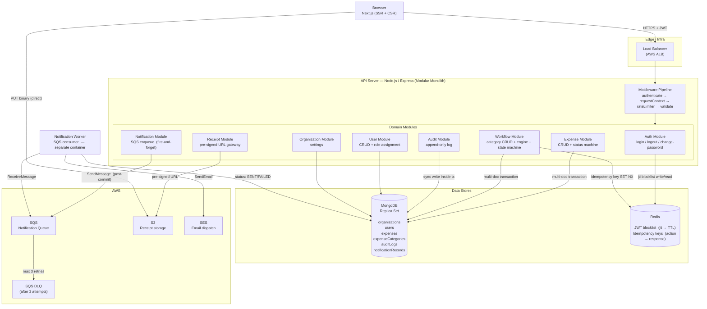
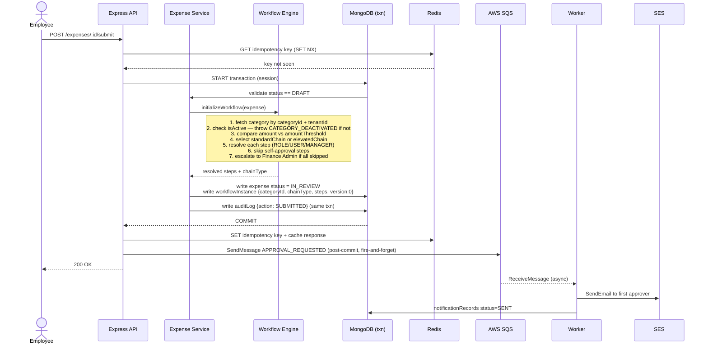

# Expense Management System with Multi-Level Approvals and Role Management

---

## Assumptions

Before getting into the design, here are the assumptions I made to keep the scope focused and the decisions defensible.

The platform is multi-tenant SaaS. Each organization is an isolated tenant and no data crosses tenant boundaries under any circumstance. Users belong to exactly one tenant.

Approval workflows are sequential, not parallel. One approver acts at a time, and the chain moves forward only after each step is resolved. Parallel approvals are a real enterprise need but add significant state machine complexity that isn't justified for an MVP.

The approval chain is resolved at the moment an expense is submitted. If a category's configuration changes after an expense enters review, the in-flight expense is unaffected. This gives you audit consistency: you can always answer exactly which chain governed which expense.

Roles are predefined. There are four: Employee, Manager, Finance Admin, and Organization Admin. Custom roles are out of scope for now.

Receipt attachments are optional. Some expenses (meals, ground transport) don't always come with a receipt.

Payment processing is out of scope. The platform tracks the approval lifecycle and marks expenses as paid, but does not integrate with any payment gateway.

English only, single timezone for MVP, email notifications only.

JWT-based authentication with short-lived tokens (1 hour). No SSO or SAML at this stage.

Expense categories are created and managed by the Workflow Admin. Each category has two approval chains: a standard chain for amounts at or below the category threshold, and an elevated chain for amounts above it. There is no rule conflict to resolve; selecting a chain is a deterministic lookup against a single category record.

Employees cannot submit an expense under a deactivated category. The draft is blocked until the admin reactivates the category or the employee switches to a different one.

If a step in the resolved approval chain would self-approve (the approver is the submitter), that step is skipped. If all steps are skipped, the workflow escalates to any active Finance Admin in the tenant. If no Finance Admin exists, submission fails with a clear error and the expense stays in Draft.

---

## Functional Requirements

### Expense Management

Employees can create expenses with a title, amount, currency, date, category, description, and an optional receipt. Expenses start as drafts and can be edited freely until submitted. Once submitted, an expense cannot be edited directly. It must be withdrawn first (if the review hasn't started) or sent back by an approver.

Employees can withdraw a submitted expense before any approver has acted on it, returning it to Draft.

The system tracks expense status across the full lifecycle: Draft, Submitted, In Review, Approved, Rejected, and Paid.

### Approval Workflow

When an expense is submitted, the workflow engine looks up the active category the employee selected. If the category is deactivated, submission fails immediately. Otherwise the engine compares the expense amount against the category's `amountThreshold` and picks the standard chain (at or below the threshold) or the elevated chain (above it). The resolved approval chain is written to the expense record and does not change for the lifetime of that workflow instance.

Approvers can approve, reject, or send back an expense with a comment. Approving the final step transitions the expense to Approved. Rejecting at any step terminates the workflow and moves the expense to Rejected. Sending back archives the current workflow instance to history, returns the expense to Draft, and clears the current workflow so a fresh one is created on resubmission.

Finance Admins can mark a fully approved expense as Paid.

### Role and Access Management

Four roles: Employee, Manager, Finance Admin, and Organization Admin. Users can hold multiple roles. An Organization Admin manages users and roles. A Finance Admin, acting as Workflow Admin, sees all expenses in the tenant, manages expense categories and their approval chains, and handles payment marking. A Manager sees their own expenses plus any pending approval steps assigned to them. An Employee sees only their own expenses.

### Notifications

Email notifications go out when an expense is submitted for approval, when an approver approves or rejects, when an expense is sent back for changes, and when it is marked as paid.

### Audit

Every workflow action (submit, approve, reject, send back, withdraw, mark paid) produces an immutable audit record capturing who did what, when, and with what comment. Audit history is visible to Finance Admins and Organization Admins.

---

## Non-Functional Requirements

Response times for expense submission and approval actions should stay under 500ms, excluding file uploads which go directly to object storage.

Workflow state transitions must be atomic. A partial state is worse than a failed request, so every transition that touches more than one field uses a database transaction.

The platform must support complete tenant isolation. A user in one organization must not be able to access or infer the existence of data in another, even if they know the resource IDs.

Notifications are best-effort and asynchronous. A failed email must not roll back any business state.

Expense categories and their approval chains must be configurable through the application UI by the Workflow Admin, not through code changes or deployments.

The system should be horizontally scalable. The API tier is stateless; the notification processing tier can be scaled independently.

Structured JSON logs on every request and business operation, including a trace ID that flows from the HTTP request through to the async notification worker.

---

## API Design

All endpoints are under `/api/v1`. Every request to a protected endpoint must carry a valid JWT in the Authorization header.

### Auth

```
POST   /api/v1/auth/login
POST   /api/v1/auth/logout
POST   /api/v1/auth/change-password
```

Login returns a signed JWT. Logout adds the token's unique ID to a revocation list so the token is dead immediately, not just expired. Change password revokes the current token too.

### Users

```
POST   /api/v1/users
GET    /api/v1/users
GET    /api/v1/users/:userId
PATCH  /api/v1/users/:userId
PUT    /api/v1/users/:userId/roles
POST   /api/v1/users/:userId/activate
POST   /api/v1/users/:userId/deactivate
```

Only Organization Admins can create users, assign roles, or activate/deactivate accounts. Users can update their own profile but cannot change their own roles or department. A non-admin requesting another user's profile gets a 404, not a 403. Confirming a resource exists via a 403 is a security leak.

### Expenses

```
POST   /api/v1/expenses
GET    /api/v1/expenses
GET    /api/v1/expenses/:expenseId
PATCH  /api/v1/expenses/:expenseId
POST   /api/v1/expenses/:expenseId/submit
POST   /api/v1/expenses/:expenseId/withdraw
POST   /api/v1/expenses/:expenseId/mark-paid
```

Amounts are always integers in the smallest currency unit (cents for USD). Never floats. The list endpoint is role-scoped: employees see their own, managers see pending approvals assigned to them, Finance Admins and Org Admins see everything in the tenant.

### Workflow Actions

```
POST   /api/v1/expenses/:expenseId/workflow/approve
POST   /api/v1/expenses/:expenseId/workflow/reject
POST   /api/v1/expenses/:expenseId/workflow/send-back
GET    /api/v1/expenses/:expenseId/audit-log
```

All three action endpoints require an `idempotencyKey` in the request body. If the same key is seen again within its TTL, the cached response is returned with an `X-Idempotent-Replay: true` header. This handles double-clicks and network retries without re-processing.

### Expense Categories

```
POST   /api/v1/expense-categories
GET    /api/v1/expense-categories
GET    /api/v1/expense-categories/:categoryId
PATCH  /api/v1/expense-categories/:categoryId
POST   /api/v1/expense-categories/:categoryId/activate
POST   /api/v1/expense-categories/:categoryId/deactivate
```

Categories are created inactive by default. The Workflow Admin explicitly activates them. There is no DELETE; categories are deactivated, not removed, so historical expenses always reference a resolvable category. Each category carries an `amountThreshold`, a `standardChain`, and an `elevatedChain`.

### Receipts

```
POST   /api/v1/receipts/upload-url
GET    /api/v1/expenses/:expenseId/receipt
```

The upload flow uses pre-signed URLs. The client requests an upload URL, uploads the file directly to S3, then attaches the resulting S3 key to the expense. The binary never passes through the API server.

### Organization

```
GET    /api/v1/organization
PUT    /api/v1/organization/settings
```

### Authorization Matrix

| Endpoint | Employee | Manager | Finance Admin | Org Admin |
|---|---|---|---|---|
| Create expense | Yes | Yes | Yes | Yes |
| View own expense | Yes | Yes | Yes | Yes |
| View all expenses | No | No | Yes | Yes |
| Submit expense | Yes (own) | Yes (own) | Yes (own) | Yes (own) |
| Withdraw expense | Yes (own, Submitted) | Yes (own) | No | No |
| Approve / Reject / Send Back | No | Yes (assigned step) | Yes (assigned step) | No |
| Mark as Paid | No | No | Yes | No |
| Create / manage users | No | No | No | Yes |
| Manage expense categories | No | No | Yes | Yes |
| View audit log | No | No | Yes | Yes |

---

## Data Models

### Organization

```
{
  _id:        ObjectId,
  name:       String,
  domain:     String,
  settings:   { defaultCurrency: String, fiscalYearStart: Number },
  createdAt:  Date,
  updatedAt:  Date
}
```

### User

```
{
  _id:          ObjectId,
  tenantId:     ObjectId,
  email:        String (unique within tenant),
  passwordHash: String (never returned in responses),
  firstName:    String,
  lastName:     String,
  department:   String,
  managerId:    ObjectId (ref: User),
  roles:        [String],  // ["employee", "manager", "financeAdmin", "orgAdmin"]
  isActive:     Boolean,
  createdAt:    Date,
  updatedAt:    Date
}
```

Indexes: `{ tenantId, email }` unique, `{ tenantId, roles }`, `{ tenantId, department, roles }`.

### Expense

The workflow instance is embedded directly in the expense document. This is a deliberate choice: every workflow action is a single-document write. There is no need for a cross-collection transaction just to advance an approval step.

```
{
  _id:           ObjectId,
  tenantId:      ObjectId,
  submittedBy:   ObjectId,
  title:         String,
  amount:        Number (integer, cents),
  currency:      String,
  date:          Date,
  categoryId:    ObjectId (ref: expenseCategories),
  categoryName:  String (denormalized for display),
  description:   String,
  receiptKey:    String (S3 object key),
  status:        String,  // DRAFT | SUBMITTED | IN_REVIEW | APPROVED | REJECTED | PAID
  workflowInstance: {
    categoryId:  ObjectId,
    chainType:   String,   // STANDARD | ELEVATED
    version:     Number,   // optimistic lock
    steps: [{
      stepIndex:   Number,
      approverId:  ObjectId,
      status:      String,  // PENDING | APPROVED | REJECTED | SKIPPED
      comment:     String,
      actedAt:     Date
    }],
    currentStepIndex: Number,
    startedAt:   Date,
    completedAt: Date
  },
  workflowHistory: [ /* archived instances from previous send-back cycles */ ],
  createdAt:     Date,
  updatedAt:     Date
}
```

Indexes: `{ tenantId, submittedBy, status }`, `{ tenantId, status }`, `{ tenantId, createdAt }`. Multikey index on `{ tenantId, "workflowInstance.steps.approverId", "workflowInstance.steps.status" }` to power the manager approval queue without a collection scan.

### Expense Category

```
{
  _id:             ObjectId,
  tenantId:        ObjectId,
  name:            String,
  isActive:        Boolean,
  amountThreshold: Number (integer, cents),
  standardChain: [{
    order:         Number,
    approverType:  String,  // ROLE | USER | MANAGER
    approverValue: String
  }],
  elevatedChain: [{
    order:         Number,
    approverType:  String,
    approverValue: String
  }],
  createdAt:       Date,
  updatedAt:       Date
}
```

### Audit Log

Kept in a separate collection because it's append-only, queried by expense, and can accumulate dozens of entries. Embedding it in the expense would bloat every read.

```
{
  _id:        ObjectId,
  tenantId:   ObjectId,
  expenseId:  ObjectId,
  actorId:    ObjectId,
  action:     String,  // SUBMITTED | APPROVED | REJECTED | SENT_BACK | WITHDRAWN | MARKED_PAID
  comment:    String,
  metadata:   Object,
  createdAt:  Date
}
```

Index: `{ expenseId, tenantId, createdAt }`.

---

## System Architecture

The system is a modular monolith for the MVP. Each domain is a self-contained module (its own routes, controller, service, repository, and model) but everything runs in one deployable unit. This avoids the operational complexity of microservices (distributed tracing, service discovery, network partitions between services) at a stage where team and traffic don't justify it. The module boundaries are real though: no cross-module file imports, only explicit service interfaces. If a module needs to scale independently or gets owned by a separate team, it can be extracted.



The notification worker is a separate Node.js process running from the same codebase. In production it runs as a separate container, which lets it be scaled independently from the API tier. Everything else shares one process and one deploy.

MongoDB runs as a replica set from day one because multi-document transactions require it. S3 stores receipts. SQS decouples notification delivery from the request path. Redis handles two things: JWT revocation (blocklist keyed by token ID) and workflow action idempotency keys.

The diagram above shows the full system topology and labeled data flows. The diagram below zooms into a single expense submission request to show exactly where the transaction boundary sits, when the audit write happens, and why SQS enqueue must happen after commit.



---

## Workflow Engine Approach

The workflow engine is a pure function state machine, not a BPMN engine or an external orchestration service. For sequential approval workflows with a known, finite set of transitions, a custom state machine is simpler, faster, and easier to reason about than a general-purpose engine.

### Category Lookup and Chain Selection

When an expense is submitted, the engine does a single lookup: fetch the expense category by `categoryId` and `tenantId`. If the category is not found or is deactivated, submission fails with `CATEGORY_DEACTIVATED` and the expense stays in Draft.

Once the category is loaded, the chain is chosen by a single comparison: if the expense amount is at or below `amountThreshold`, use `standardChain`; if it is above the threshold, use `elevatedChain`. The selected `chainType` (STANDARD or ELEVATED) is stored in the workflow instance alongside the `categoryId`. This means a later threshold change has no effect on in-flight expenses, but you can always reconstruct exactly which chain governed an approval.

### Chain Resolution

With the chain selected, the engine resolves the approver chain. Each step has an approver type:

- `ROLE`: resolves to all active users in the tenant holding that role
- `USER`: resolves to a specific named user
- `MANAGER`: resolves to the submitter's `managerId`, walking up the hierarchy

Self-approval check happens here. If a resolved approver is the submitter, that step is marked as SKIPPED. If all steps are skipped, the engine looks for any active Finance Admin in the tenant. If none exists, submission fails with `APPROVER_RESOLUTION_FAILED`. The expense stays in Draft.

The resolved chain is written to `workflowInstance.steps` inside the expense document. It does not change after this point.

### State Transitions

All state transitions run inside a MongoDB transaction. Approve, reject, send back, submit, withdraw, and mark paid each touch multiple fields atomically. There is no state where the expense status and the workflow step status can be out of sync.

Concurrent approval requests (two approvers somehow both hitting approve at the same millisecond) are handled via optimistic locking. The update filter includes `{ "workflowInstance.version": N }`. Only one write matches. The second gets zero documents modified and returns a `409 CONFLICT`. No pessimistic locking needed.

State flow:

```
DRAFT
  |
  |-- submit() ---------> SUBMITTED
                              |
                              |-- initializeWorkflow() --> IN_REVIEW
                              |                               |
                              |-- withdraw() -----------> DRAFT
                                                             |
                                               approve (intermediate step)
                                                             |
                                               approve (final step) --> APPROVED
                                                             |               |
                                               reject() --> REJECTED     mark-paid() --> PAID
                                                             |
                                               send-back() --> DRAFT (new workflow on resubmit)
```

---

## Role and Permission Model

Four predefined roles. Users can hold multiple roles simultaneously (a person can be both an Employee and a Manager).

**Employee**: Create, read, update (draft only), and submit their own expenses. Withdraw their own submitted expenses before review. No visibility into other users' expenses.

**Manager**: Everything an Employee can do. Additionally, can approve, reject, or send back expenses where they are the current pending approver.

**Finance Admin**: Read all expenses in the tenant. Approve, reject, send back (when assigned). Mark approved expenses as paid. Create and manage expense categories (including thresholds and approval chains). View audit logs.

**Organization Admin**: Manage users (create, update, activate, deactivate, assign roles). View organization settings. Cannot approve expenses directly and cannot manage expense categories. This is an intentional separation of duties: the person who manages users should not also be configuring approval chains.

Permission checks happen at two layers. The route layer uses an `authorize(role)` middleware that rejects the request before it reaches the service. The data layer uses role-scoped queries in repositories. For example, the expense list query for a Manager includes only expenses where `workflowInstance.steps` contains a PENDING step assigned to that Manager's user ID. This is not a filter applied after fetching everything; it is built into the query.

The 404 vs 403 decision: any resource a user is not permitted to see returns 404, not 403. A 403 confirms the resource exists, which is information an attacker can use to enumerate IDs. 404 reveals nothing.

---

## Scalability Strategy

**Stateless API tier.** No in-process session state. JWTs carry all authentication context. Any number of API instances can run behind a load balancer and any request can land on any instance.

**Tenant-prefixed queries and indexes.** Every MongoDB query starts with a `tenantId` filter and every index is prefixed with `tenantId`. This means a large tenant's data volume does not degrade query performance for other tenants, and vice versa. At extreme scale, collections can be sharded by `tenantId`.

**Asynchronous notifications.** Notification delivery is decoupled from the request path via SQS. An approval action completes as soon as the database transaction commits. The SQS message is enqueued after commit (never inside it). Email delivery failures, SES latency spikes, or dead letters do not affect approval latency. Workers scale horizontally by adding more SQS consumers.

**Manager approval queue via multikey index.** The most read-heavy query at scale is "show me all expenses I need to approve." This is served by a multikey index on the embedded step array, not a collection scan. Query time stays consistent as expense volume grows.

**Cursor-based pagination.** List endpoints use cursor-based pagination, not offset. Offset pagination requires skipping N rows, which degrades as the dataset grows. Cursors are stable and constant-time regardless of collection size.

**Rate limiting per tenant.** Rate limits are enforced per tenant, not per IP. Enterprise organizations route traffic from hundreds of employees through a shared corporate IP range. Per-tenant limits using a Redis store prevent one noisy tenant from starving others.

**Read replicas for analytics-heavy paths.** Audit log queries and org-wide expense reports are read-heavy and not latency-sensitive. These can be routed to a MongoDB read replica as traffic grows, without touching the primary.

---

## Security Considerations

**Authentication.** JWTs with a short 1-hour TTL. Token claims include a unique `jti` (JWT ID). On logout or password change, the `jti` is written to a Redis blocklist with a TTL matching the token's remaining lifetime. Any request carrying a revoked `jti` is rejected at the authentication middleware, before it reaches any business logic.

**Tenant isolation.** The `tenantId` is a required parameter on every repository method, not an optional filter. TypeScript enforces this at compile time. Integration tests assert cross-tenant isolation on every data read path by creating two tenants, inserting data in both, and verifying neither can access the other's records.

**Least privilege.** Every endpoint is gated by both authentication and role authorization. Services and repositories enforce their own access rules independently of the controller, so a misconfigured route does not automatically open up data access.

**Receipt security.** Files are uploaded directly from the client to S3 using pre-signed URLs with a 5-minute expiry. The binary never passes through the API server. Download URLs are also pre-signed and short-lived. The `receiptKey` is validated for the correct tenant prefix before it is attached to an expense, preventing a user from referencing another tenant's file.

**No stack traces in responses.** Error responses contain only a machine-readable code, a human-readable message, and a trace ID. Full stack traces are logged server-side only. A user can report a trace ID to support without the server leaking implementation details.

**Password handling.** Passwords are hashed with bcrypt (12 rounds). The `passwordHash` field is excluded at the repository layer, not filtered in the controller. API response integration tests assert its absence.

**Idempotency keys.** Workflow action endpoints require client-supplied idempotency keys. The key is checked in Redis with `SET NX` before the transaction opens. The key is written to Redis only after the transaction commits. This gap means a failed transaction does not permanently block a retry.

---

## Failure Handling and Recovery

**Workflow state transitions.** Every transition uses a MongoDB transaction. If the connection drops mid-flight, the transaction rolls back automatically. The expense and workflow instance are always consistent with each other. There is no partial state.

**Optimistic lock conflicts.** If two requests try to advance the same workflow step simultaneously, only one succeeds. The second gets a `409 CONFLICT` response and the client retries with a new idempotency key if appropriate. This is the correct outcome: the second request was either a duplicate or a racing concurrent actor, and in both cases rejecting it is right.

**Notification failures.** SQS enqueue is a fire-and-forget call made after the transaction commits. If it fails, the failure is logged as a warning but does not affect the workflow state. The business action already committed successfully. Notification delivery is an observability concern, not a correctness concern.

**SQS retries and dead letter queue.** The notification worker does not delete a message from SQS until it has confirmed successful delivery. If SES fails, the message stays in the queue and SQS redelivers it after the visibility timeout (30 seconds initially). After 3 delivery attempts, the message moves to a Dead Letter Queue. A CloudWatch alarm fires when the DLQ depth goes above zero, triggering manual inspection and replay.

**Redis unavailability.** The JWT blocklist check is fail-open. If Redis is unreachable during the blocklist check, the request proceeds with a warning logged. The alternative, fail-closed, would block every authenticated request during a Redis outage. For 1-hour tokens this is an acceptable tradeoff. Idempotency key checks also fail-open: a Redis miss means the action proceeds normally.

**Deactivated category on submit.** If the category selected by the employee has been deactivated, the submit fails immediately with a `422 CATEGORY_DEACTIVATED` error and the expense stays in Draft. The submitter sees a clear error telling them to switch to an active category or wait for the admin to reactivate it. This is preferable to silently auto-approving or routing the expense through a stale chain.

---

## Audit Mechanisms and Logging

### Audit Log

Every action that changes expense or workflow state writes an audit record synchronously inside the database transaction. Audit writes are not fire-and-forget. An action that commits without an audit record is worse than an action that fails and rolls back cleanly. This is a compliance design choice: the audit log must be complete and consistent with the business state.

Each record captures:

- Who did it (actorId, resolved to name at read time)
- What they did (SUBMITTED, APPROVED, REJECTED, SENT_BACK, WITHDRAWN, MARKED_PAID)
- When (timestamp with millisecond precision)
- Why (free-text comment, optional)
- Context (expenseId, tenantId, workflow step index)

The audit collection is append-only. There are no update or delete operations on it. Finance Admins and Org Admins can query the full audit trail for any expense in their tenant.

### Structured Application Logging

Every log line is structured JSON. Every line includes `timestamp`, `level`, `traceId`, `tenantId`, `userId`, `module`, `action`, and `durationMs`. Errors additionally include the error code, message, and stack trace (server-side only, never sent to clients).

A `traceId` is generated at the edge (request context middleware) and attached to every log line for that request. When a notification is enqueued, the `traceId` is included in the SQS message payload. The notification worker extracts it and uses it as a log field. This gives end-to-end trace correlation from the HTTP request through to the async email dispatch, without a distributed tracing infrastructure.

Log levels:

- `ERROR`: unhandled exceptions, transaction rollbacks, SQS publish failures
- `WARN`: Redis unavailability, SQS enqueue failure, DLQ depth alerts
- `INFO`: all business events (expense submitted, workflow step approved, etc.), request start and end
- `DEBUG`: category lookup result, chain type selected, approver resolution details (development environments only)

Logs are emitted to stdout and captured by the container orchestrator for forwarding to a log aggregation service. The application never writes log files directly.
